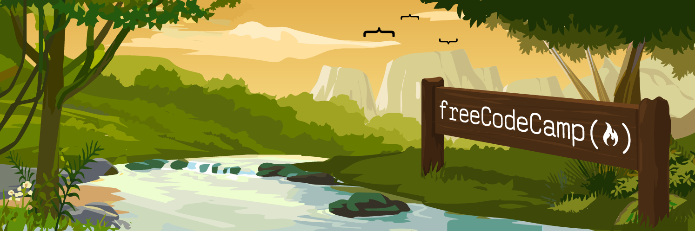

# freeCodeCamp – All Certifications



Solutions and projects from the [freeCodeCamp](https://www.freecodecamp.org) platform, covering web development, JavaScript, and Python.

## About

This repository tracks my progress through the freeCodeCamp curriculum. Each folder corresponds to a certification/course and contains all related projects and exercises.

> **Note:** Certifications marked as completed were earned prior to this repo being created. Their source files will be uploaded progressively.

## Certifications

### 🔄 In Progress

| Certification | Folder | Status |
|---|---|---|
| Python Certification | [`python_certification/`](./python_certification/) | 🔄 In Progress |

### ✅ Completed

| Certification | Folder | Status |
|---|---|---|
| Legacy Responsive Web Design | [`responsive_web_design/`](./responsive_web_design/) | ✅ Completed |
| Legacy JavaScript Algorithms and Data Structures | [`javascript_algorithms/`](./javascript_algorithms/) | ✅ Completed |
| Scientific Computing with Python | [`scientific_computing_python/`](./scientific_computing_python/) | ✅ Completed |

## Structure

```
freeCodeCamp/
├── python_certification/         # Python Certification projects (in progress)
├── responsive_web_design/        # Legacy Responsive Web Design V8 projects
├── javascript_algorithms/        # Legacy JavaScript Algorithms & Data Structures V8 projects
├── scientific_computing_python/  # Scientific Computing with Python projects
└── public/                       # Assets (images, gifs)
```

## Platform

[freecodecamp.org](https://www.freecodecamp.org)

